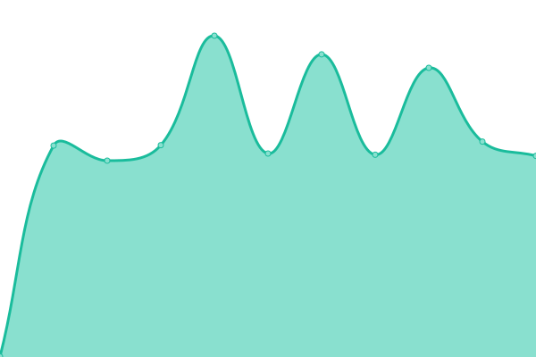

# [📈 Live Status](https://up.nbox.dev): <!--live status--> **🟩 All systems operational**

This repository contains the open-source uptime monitor and status page for [NBOXDEV](https://up.nbox.dev), powered by [Upptime](https://github.com/upptime/upptime).

With [Upptime](https://upptime.js.org), you can get your own unlimited and free uptime monitor and status page, powered entirely by a GitHub repository. We use [Issues](https://github.com/nboxdev/upptime/issues) as incident reports, [Actions](https://github.com/nboxdev/upptime/actions) as uptime monitors, and [Pages](https://up.nbox.dev) for the status page.

<!--start: status pages-->
<!-- This summary is generated by Upptime (https://github.com/upptime/upptime) -->
<!-- Do not edit this manually, your changes will be overwritten -->
<!-- prettier-ignore -->
| URL | Status | History | Response Time | Uptime |
| --- | ------ | ------- | ------------- | ------ |
|  Plex Server | 🟩 Up | [plex-server.yml](https://github.com/nboxdev/upptime/commits/HEAD/history/plex-server.yml) | 

 679ms
     
 | 

<a href="https://up.nbox.dev/history/plex-server">100.00%</a>
    

|  Bazarr | 🟩 Up | [bazarr.yml](https://github.com/nboxdev/upptime/commits/HEAD/history/bazarr.yml) | 

 487ms
     
 | 

<a href="https://up.nbox.dev/history/bazarr">100.00%</a>
    

|  Bazarr4K | 🟩 Up | [bazarr4-k.yml](https://github.com/nboxdev/upptime/commits/HEAD/history/bazarr4-k.yml) | 

 479ms
     
 | 

<a href="https://up.nbox.dev/history/bazarr4-k">100.00%</a>
    

|  Immich | 🟩 Up | [immich.yml](https://github.com/nboxdev/upptime/commits/HEAD/history/immich.yml) | 

 1015ms
     
 | 

<a href="https://up.nbox.dev/history/immich">100.00%</a>
    

|  Lavalink | 🟩 Up | [lavalink.yml](https://github.com/nboxdev/upptime/commits/HEAD/history/lavalink.yml) | 

 483ms
     
 | 

<a href="https://up.nbox.dev/history/lavalink">100.00%</a>
    

|  LibreSpeed | 🟩 Up | [libre-speed.yml](https://github.com/nboxdev/upptime/commits/HEAD/history/libre-speed.yml) | 

 490ms
     
 | 

<a href="https://up.nbox.dev/history/libre-speed">100.00%</a>
    

|  Memos | 🟩 Up | [memos.yml](https://github.com/nboxdev/upptime/commits/HEAD/history/memos.yml) | 

 469ms
     
 | 

<a href="https://up.nbox.dev/history/memos">100.00%</a>
    

|  Notifiarr | 🟩 Up | [notifiarr.yml](https://github.com/nboxdev/upptime/commits/HEAD/history/notifiarr.yml) | 

 494ms
     
 | 

<a href="https://up.nbox.dev/history/notifiarr">100.00%</a>
    

|  Prowlarr | 🟩 Up | [prowlarr.yml](https://github.com/nboxdev/upptime/commits/HEAD/history/prowlarr.yml) | 

 600ms
     
 | 

<a href="https://up.nbox.dev/history/prowlarr">100.00%</a>
    

|  qBittorrent | 🟩 Up | [q-bittorrent.yml](https://github.com/nboxdev/upptime/commits/HEAD/history/q-bittorrent.yml) | 

 465ms
     
 | 

<a href="https://up.nbox.dev/history/q-bittorrent">100.00%</a>
    

|  Radarr | 🟩 Up | [radarr.yml](https://github.com/nboxdev/upptime/commits/HEAD/history/radarr.yml) | 

 597ms
     
 | 

<a href="https://up.nbox.dev/history/radarr">100.00%</a>
    

|  Radarr4K | 🟩 Up | [radarr4-k.yml](https://github.com/nboxdev/upptime/commits/HEAD/history/radarr4-k.yml) | 

 585ms
     
 | 

<a href="https://up.nbox.dev/history/radarr4-k">100.00%</a>
    

|  SABnzbd | 🟩 Up | [sa-bnzbd.yml](https://github.com/nboxdev/upptime/commits/HEAD/history/sa-bnzbd.yml) | 

 584ms
     
 | 

<a href="https://up.nbox.dev/history/sa-bnzbd">100.00%</a>
    

|  Sonarr | 🟩 Up | [sonarr.yml](https://github.com/nboxdev/upptime/commits/HEAD/history/sonarr.yml) | 

 582ms
     
 | 

<a href="https://up.nbox.dev/history/sonarr">100.00%</a>
    

|  Sonarr4K | 🟩 Up | [sonarr4-k.yml](https://github.com/nboxdev/upptime/commits/HEAD/history/sonarr4-k.yml) | 

 569ms
     
 | 

<a href="https://up.nbox.dev/history/sonarr4-k">100.00%</a>
    

|  Tautulli | 🟩 Up | [tautulli.yml](https://github.com/nboxdev/upptime/commits/HEAD/history/tautulli.yml) | 

 686ms
     
 | 

<a href="https://up.nbox.dev/history/tautulli">100.00%</a>
    

|  Wizarr | 🟩 Up | [wizarr.yml](https://github.com/nboxdev/upptime/commits/HEAD/history/wizarr.yml) | 

 476ms
     
 | 

<a href="https://up.nbox.dev/history/wizarr">100.00%</a>
    

|  Wrapperr | 🟩 Up | [wrapperr.yml](https://github.com/nboxdev/upptime/commits/HEAD/history/wrapperr.yml) | 

 478ms
     
 | 

<a href="https://up.nbox.dev/history/wrapperr">100.00%</a>
    

<!--end: status pages-->

[**Visit our status website →**](https://up.nbox.dev)

## 📄 License

- Powered by: [Upptime](https://github.com/upptime/upptime)
- Code: [MIT](./LICENSE) © [Anand Chowdhary](https://anandchowdhary.com), supported by [Pabio](https://pabio.com)
- Data in the `./history` directory: [Open Database License](https://opendatacommons.org/licenses/odbl/1-0/)
