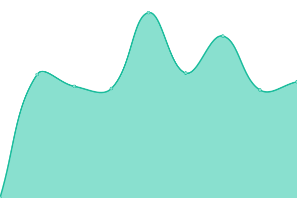

# [📈 Live Status](https://up.nbox.dev): <!--live status--> **🟩 All systems operational**

This repository contains the open-source uptime monitor and status page for [NBOXDEV](https://up.nbox.dev), powered by [Upptime](https://github.com/upptime/upptime).

With [Upptime](https://upptime.js.org), you can get your own unlimited and free uptime monitor and status page, powered entirely by a GitHub repository. We use [Issues](https://github.com/nboxdev/upptime/issues) as incident reports, [Actions](https://github.com/nboxdev/upptime/actions) as uptime monitors, and [Pages](https://up.nbox.dev) for the status page.

<!--start: status pages-->
<!-- This summary is generated by Upptime (https://github.com/upptime/upptime) -->
<!-- Do not edit this manually, your changes will be overwritten -->
<!-- prettier-ignore -->
| URL | Status | History | Response Time | Uptime |
| --- | ------ | ------- | ------------- | ------ |
|  Plex Server | 🟩 Up | [plex-server.yml](https://github.com/nboxdev/upptime/commits/HEAD/history/plex-server.yml) | 

 755ms
     
 | 

<a href="https://up.nbox.dev/history/plex-server">98.63%</a>
    

|  Bazarr | 🟩 Up | [bazarr.yml](https://github.com/nboxdev/upptime/commits/HEAD/history/bazarr.yml) | 

 676ms
     
 | 

<a href="https://up.nbox.dev/history/bazarr">98.64%</a>
    

|  Bazarr4K | 🟩 Up | [bazarr4-k.yml](https://github.com/nboxdev/upptime/commits/HEAD/history/bazarr4-k.yml) | 

 660ms
     
 | 

<a href="https://up.nbox.dev/history/bazarr4-k">98.64%</a>
    

|  Immich | 🟩 Up | [immich.yml](https://github.com/nboxdev/upptime/commits/HEAD/history/immich.yml) | 

 663ms
     
 | 

<a href="https://up.nbox.dev/history/immich">98.65%</a>
    

|  Lavalink | 🟩 Up | [lavalink.yml](https://github.com/nboxdev/upptime/commits/HEAD/history/lavalink.yml) | 

 651ms
     
 | 

<a href="https://up.nbox.dev/history/lavalink">98.65%</a>
    

|  LibreSpeed | 🟩 Up | [libre-speed.yml](https://github.com/nboxdev/upptime/commits/HEAD/history/libre-speed.yml) | 

 672ms
     
 | 

<a href="https://up.nbox.dev/history/libre-speed">98.65%</a>
    

|  Memos | 🟩 Up | [memos.yml](https://github.com/nboxdev/upptime/commits/HEAD/history/memos.yml) | 

 634ms
     
 | 

<a href="https://up.nbox.dev/history/memos">98.66%</a>
    

|  Notifiarr | 🟩 Up | [notifiarr.yml](https://github.com/nboxdev/upptime/commits/HEAD/history/notifiarr.yml) | 

 650ms
     
 | 

<a href="https://up.nbox.dev/history/notifiarr">98.66%</a>
    

|  Overseerr | 🟩 Up | [overseerr.yml](https://github.com/nboxdev/upptime/commits/HEAD/history/overseerr.yml) | 

 1435ms
     
 | 

<a href="https://up.nbox.dev/history/overseerr">98.67%</a>
    

|  Overseerr (Kids/Nordic) | 🟩 Up | [overseerr-kids-nordic.yml](https://github.com/nboxdev/upptime/commits/HEAD/history/overseerr-kids-nordic.yml) | 

 1426ms
     
 | 

<a href="https://up.nbox.dev/history/overseerr-kids-nordic">98.67%</a>
    

|  Prowlarr | 🟩 Up | [prowlarr.yml](https://github.com/nboxdev/upptime/commits/HEAD/history/prowlarr.yml) | 

 927ms
     
 | 

<a href="https://up.nbox.dev/history/prowlarr">98.68%</a>
    

|  qBittorrent | 🟩 Up | [q-bittorrent.yml](https://github.com/nboxdev/upptime/commits/HEAD/history/q-bittorrent.yml) | 

 603ms
     
 | 

<a href="https://up.nbox.dev/history/q-bittorrent">98.68%</a>
    

|  Radarr | 🟩 Up | [radarr.yml](https://github.com/nboxdev/upptime/commits/HEAD/history/radarr.yml) | 

 800ms
     
 | 

<a href="https://up.nbox.dev/history/radarr">98.69%</a>
    

|  Radarr4K | 🟩 Up | [radarr4-k.yml](https://github.com/nboxdev/upptime/commits/HEAD/history/radarr4-k.yml) | 

 801ms
     
 | 

<a href="https://up.nbox.dev/history/radarr4-k">98.69%</a>
    

|  Radarr (Kids/Nordic) | 🟩 Up | [radarr-kids-nordic.yml](https://github.com/nboxdev/upptime/commits/HEAD/history/radarr-kids-nordic.yml) | 

 786ms
     
 | 

<a href="https://up.nbox.dev/history/radarr-kids-nordic">98.70%</a>
    

|  SABnzbd | 🟩 Up | [sa-bnzbd.yml](https://github.com/nboxdev/upptime/commits/HEAD/history/sa-bnzbd.yml) | 

 775ms
     
 | 

<a href="https://up.nbox.dev/history/sa-bnzbd">98.70%</a>
    

|  Sonarr | 🟩 Up | [sonarr.yml](https://github.com/nboxdev/upptime/commits/HEAD/history/sonarr.yml) | 

 790ms
     
 | 

<a href="https://up.nbox.dev/history/sonarr">98.70%</a>
    

|  Sonarr4K | 🟩 Up | [sonarr4-k.yml](https://github.com/nboxdev/upptime/commits/HEAD/history/sonarr4-k.yml) | 

 793ms
     
 | 

<a href="https://up.nbox.dev/history/sonarr4-k">98.71%</a>
    

|  Sonarr (Kids/Nordic) | 🟩 Up | [sonarr-kids-nordic.yml](https://github.com/nboxdev/upptime/commits/HEAD/history/sonarr-kids-nordic.yml) | 

 782ms
     
 | 

<a href="https://up.nbox.dev/history/sonarr-kids-nordic">98.71%</a>
    

|  Tautulli | 🟩 Up | [tautulli.yml](https://github.com/nboxdev/upptime/commits/HEAD/history/tautulli.yml) | 

 912ms
     
 | 

<a href="https://up.nbox.dev/history/tautulli">98.72%</a>
    

|  Wizarr | 🟩 Up | [wizarr.yml](https://github.com/nboxdev/upptime/commits/HEAD/history/wizarr.yml) | 

 623ms
     
 | 

<a href="https://up.nbox.dev/history/wizarr">98.98%</a>
    

|  Wrapperr | 🟩 Up | [wrapperr.yml](https://github.com/nboxdev/upptime/commits/HEAD/history/wrapperr.yml) | 

 625ms
     
 | 

<a href="https://up.nbox.dev/history/wrapperr">98.99%</a>
    

<!--end: status pages-->

[**Visit our status website →**](https://up.nbox.dev)

## 📄 License

- Powered by: [Upptime](https://github.com/upptime/upptime)
- Code: [MIT](./LICENSE) © [Anand Chowdhary](https://anandchowdhary.com), supported by [Pabio](https://pabio.com)
- Data in the `./history` directory: [Open Database License](https://opendatacommons.org/licenses/odbl/1-0/)
