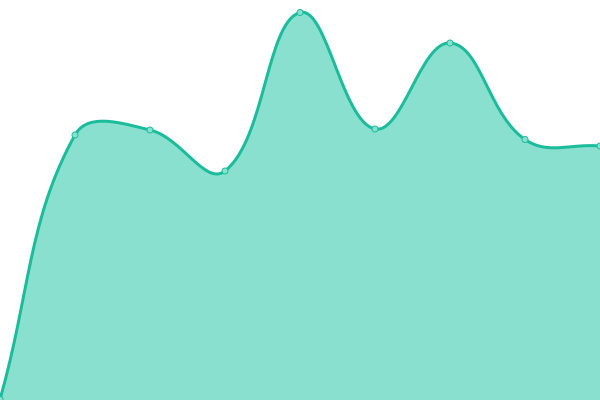
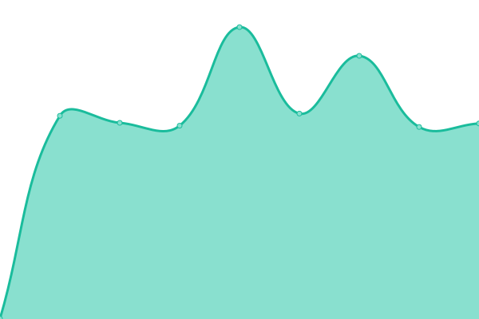

# [📈 Live Status](https://up.nbox.dev): <!--live status--> **🟥 Complete outage**

This repository contains the open-source uptime monitor and status page for [NBOXDEV](https://up.nbox.dev), powered by [Upptime](https://github.com/upptime/upptime).

With [Upptime](https://upptime.js.org), you can get your own unlimited and free uptime monitor and status page, powered entirely by a GitHub repository. We use [Issues](https://github.com/nboxdev/upptime/issues) as incident reports, [Actions](https://github.com/nboxdev/upptime/actions) as uptime monitors, and [Pages](https://up.nbox.dev) for the status page.

<!--start: status pages-->
<!-- This summary is generated by Upptime (https://github.com/upptime/upptime) -->
<!-- Do not edit this manually, your changes will be overwritten -->
<!-- prettier-ignore -->
| URL | Status | History | Response Time | Uptime |
| --- | ------ | ------- | ------------- | ------ |
|  Plex Server | 🟥 Down | [plex-server.yml](https://github.com/nboxdev/upptime/commits/HEAD/history/plex-server.yml) | 

 655ms
     
 | 

<a href="https://up.nbox.dev/history/plex-server">99.60%</a>
    

|  Bazarr | 🟥 Down | [bazarr.yml](https://github.com/nboxdev/upptime/commits/HEAD/history/bazarr.yml) | 

 611ms
     
 | 

<a href="https://up.nbox.dev/history/bazarr">99.60%</a>
    

|  Bazarr4K | 🟥 Down | [bazarr4-k.yml](https://github.com/nboxdev/upptime/commits/HEAD/history/bazarr4-k.yml) | 

 534ms
     
 | 

<a href="https://up.nbox.dev/history/bazarr4-k">99.61%</a>
    

|  Immich | 🟥 Down | [immich.yml](https://github.com/nboxdev/upptime/commits/HEAD/history/immich.yml) | 

 531ms
     
 | 

<a href="https://up.nbox.dev/history/immich">99.62%</a>
    

|  Lavalink | 🟥 Down | [lavalink.yml](https://github.com/nboxdev/upptime/commits/HEAD/history/lavalink.yml) | 

 535ms
     
 | 

<a href="https://up.nbox.dev/history/lavalink">99.62%</a>
    

|  LibreSpeed | 🟥 Down | [libre-speed.yml](https://github.com/nboxdev/upptime/commits/HEAD/history/libre-speed.yml) | 

 646ms
     
 | 

<a href="https://up.nbox.dev/history/libre-speed">99.63%</a>
    

|  Memos | 🟥 Down | [memos.yml](https://github.com/nboxdev/upptime/commits/HEAD/history/memos.yml) | 

 507ms
     
 | 

<a href="https://up.nbox.dev/history/memos">99.63%</a>
    

|  Notifiarr | 🟥 Down | [notifiarr.yml](https://github.com/nboxdev/upptime/commits/HEAD/history/notifiarr.yml) | 

 545ms
     
 | 

<a href="https://up.nbox.dev/history/notifiarr">99.64%</a>
    

|  Prowlarr | 🟥 Down | [prowlarr.yml](https://github.com/nboxdev/upptime/commits/HEAD/history/prowlarr.yml) | 

 653ms
     
 | 

<a href="https://up.nbox.dev/history/prowlarr">99.64%</a>
    

|  qBittorrent | 🟥 Down | [q-bittorrent.yml](https://github.com/nboxdev/upptime/commits/HEAD/history/q-bittorrent.yml) | 

 503ms
     
 | 

<a href="https://up.nbox.dev/history/q-bittorrent">99.65%</a>
    

|  Radarr | 🟥 Down | [radarr.yml](https://github.com/nboxdev/upptime/commits/HEAD/history/radarr.yml) | 

 643ms
     
 | 

<a href="https://up.nbox.dev/history/radarr">99.65%</a>
    

|  Radarr4K | 🟥 Down | [radarr4-k.yml](https://github.com/nboxdev/upptime/commits/HEAD/history/radarr4-k.yml) | 

 633ms
     
 | 

<a href="https://up.nbox.dev/history/radarr4-k">99.66%</a>
    

|  SABnzbd | 🟥 Down | [sa-bnzbd.yml](https://github.com/nboxdev/upptime/commits/HEAD/history/sa-bnzbd.yml) | 

 642ms
     
 | 

<a href="https://up.nbox.dev/history/sa-bnzbd">99.66%</a>
    

|  Sonarr | 🟥 Down | [sonarr.yml](https://github.com/nboxdev/upptime/commits/HEAD/history/sonarr.yml) | 

 771ms
     
 | 

<a href="https://up.nbox.dev/history/sonarr">99.67%</a>
    

|  Sonarr4K | 🟥 Down | [sonarr4-k.yml](https://github.com/nboxdev/upptime/commits/HEAD/history/sonarr4-k.yml) | 

 632ms
     
 | 

<a href="https://up.nbox.dev/history/sonarr4-k">99.67%</a>
    

|  Tautulli | 🟥 Down | [tautulli.yml](https://github.com/nboxdev/upptime/commits/HEAD/history/tautulli.yml) | 

 754ms
     
 | 

<a href="https://up.nbox.dev/history/tautulli">99.68%</a>
    

|  Wizarr | 🟥 Down | [wizarr.yml](https://github.com/nboxdev/upptime/commits/HEAD/history/wizarr.yml) | 

 523ms
     
 | 

<a href="https://up.nbox.dev/history/wizarr">99.68%</a>
    

|  Wrapperr | 🟥 Down | [wrapperr.yml](https://github.com/nboxdev/upptime/commits/HEAD/history/wrapperr.yml) | 

 517ms
     
 | 

<a href="https://up.nbox.dev/history/wrapperr">99.69%</a>
    

<!--end: status pages-->

[**Visit our status website →**](https://up.nbox.dev)

## 📄 License

- Powered by: [Upptime](https://github.com/upptime/upptime)
- Code: [MIT](./LICENSE) © [Anand Chowdhary](https://anandchowdhary.com), supported by [Pabio](https://pabio.com)
- Data in the `./history` directory: [Open Database License](https://opendatacommons.org/licenses/odbl/1-0/)
